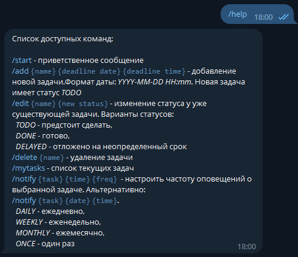
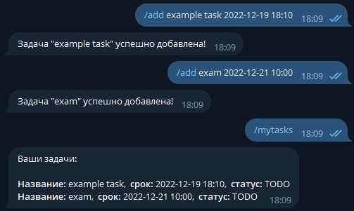
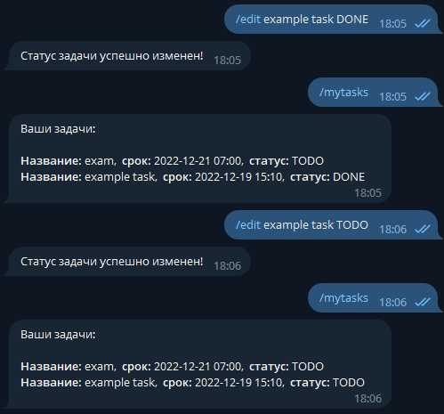
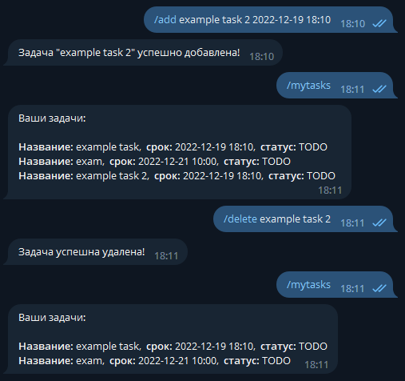
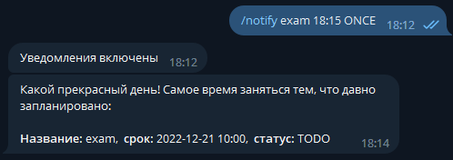
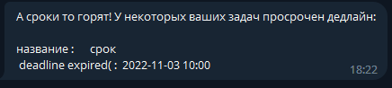

# TODO-bot
Telegram-бот для вашего тайм-менеджмента 

## Описание бота

Данный бот хранит ваши таски. Вы можете задавать им любое название, дату дедлайна, статус выполнения. Вы также можете настроить оповещения для определенных задач или для всех сразу. Если какая-то задача просрочена, бот обязательно напомнит вам о ней ;).

## Основные команды

Вместо `{что-нибудь}` вставляете свои данные.

- `/start` - запускает бота
- `/help` - показывает доступные команды
- `/add {название задачи} {дата} {время}` - добавляет новую задачу, которую вы хотите отслеживать. Дату и время указывать в формате YYYY-MM-dd HH:mm.
- `/edit {название задачи} {новый статус}` - изменить статус задачи: 
  - _TODO_ - в работе, 
  - _COMPLETED_ - задача выполнена, 
  - _DELAYED_ - задача отложена.
- `/delete {имя}` - удаляет любую вашу задачу.
- `/mytasks` - выводит все ваши задачи.
- `/notify` - добавляет уведомление к вашей задаче: 
  - `/notify {название задачи} {время} {периодичность}` - уведомления будут приходить с определенной периодичностью:
    - _DAILY_ - ежедневно
    - _WEEKLY_ - еженедельно
    - _MONTHLY_ - ежемесячно
    - _ONCE_ - один раз в день назначения
  - `/notify {название задачи} {дата} {время}` - уведомление придет один раз в указанную дату.

## Примеры

Запускаем бота:

Команда `/help`:

Команда `/add`:

Команда `/edit`:

Команда `/delete`:

Команда `/notify`:

Уведомления после дедлайна раз в полчаса будут напоминать о просроченных тасках:

## Как запустить 

### Обычный запуск

- Клонируем репозиторий

`git clone https://github.com/AntunovichPYU/TODO-bot.git`

- Запускаем проект в IDEA
- После запуска переходим в telegram и ищем бота по тегу `@todo_task_manager_bot`
- Вводим команду `/start` в чат и пользуемся :)

### Запуск в docker при помощи docker-compose

В папке с проектом в командной строке вводим `docker compose --build`

## Лицензия

[Apache License](./LICENSE)